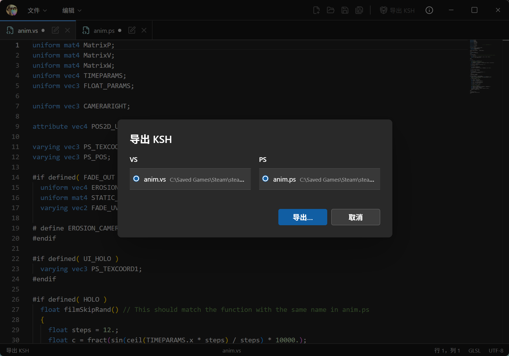

# dst-ksh-analyze

分析、构建《饥荒联机版》着色器文件的工具：从 `.ksh` 提取 VS/PS 源码，或从 VS/PS 源码构建 `.ksh`。

## 图形界面

启动桌面应用，打开 `.vs`、`.ps`、`.glsl`、`.txt` 或 `.ksh` 文件进行编辑，选择一对 VS/PS 后导出 `.ksh`。



## 命令行

CLI 独立产物为 `dst-ksh-analyze-cli`。常用命令：

```sh
# 分析 .ksh 到目录
dst-ksh-analyze-cli input.ksh output_dir

# 从目录构建 .ksh
dst-ksh-analyze-cli shader_dir output.ksh

# 从两个着色器文件构建 .ksh
dst-ksh-analyze-cli input.vs input.ps output.ksh
```

`-h` 帮助信息：

```text
用法: dst-ksh-analyze-cli.exe [OPTIONS] <输入路径> [输出路径或第二个文件] [输出文件]

Arguments:
  <输入路径>        输入路径，可以是：
                - .ksh 文件（用于分析）
                - 包含 vs 和 ps 着色器文件的目录
                - 两个着色器文件（vs 和 ps，顺序任意）
  [输出路径或第二个文件]  KSH 解包输出目录、KSH 构建输出文件，或第二个着色器文件。
  [输出文件]        输入两个着色器文件时必填的 .ksh 输出文件路径。

Options:
  -d, --debug    启用调试日志以获取更详细的输出。
  -f, --force    允许覆盖文件
  -h, --help     Print help
  -V, --version  Print version

饥荒联机版着色器文件分析与构建工具

使用示例：

分析 .ksh 文件：
	dst-ksh-analyze-cli input.ksh output_dir

从包含着色器文件的目录构建：
	dst-ksh-analyze-cli shader_dir output.ksh

从两个着色器文件构建（顺序任意）：
	dst-ksh-analyze-cli input.vs input.ps output.ksh

启用调试日志：
	dst-ksh-analyze-cli input.ksh --debug

强制覆盖已存在的文件：
	dst-ksh-analyze-cli input.ksh --force
```

## 开发构建

需要先安装：

- Node.js / npm
- Rust 工具链（rustup）
- Windows：Microsoft C++ Build Tools（MSVC）

```sh
npm install
npm run tauri build
```

仓库地址：https://github.com/TohsakaKuro/DST-ksh-analyze

许可证：BSD 3-Clause，详见 [LICENSE](./LICENSE)。